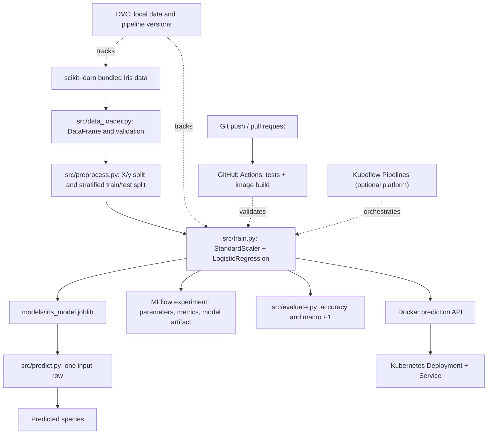

# Beginner Iris ML Project

A small, CPU-friendly classification project for learning the basic machine-learning workflow. It uses the Iris dataset bundled with scikit-learn and a logistic-regression model. The project includes local DVC and MLflow workflows, pytest coverage, a Dockerized prediction API, GitHub Actions CI, a Kubeflow Pipelines definition, and a small Kubernetes deployment.

## Dataset and model

Iris contains 150 flower observations, each with four numeric measurements: sepal length, sepal width, petal length, and petal width. The target is the flower species (`setosa`, `versicolor`, or `virginica`), so this is a three-class classification task.

The project uses logistic regression. It learns a weighted combination of the measurements to estimate a probability for each species. `C` controls regularization: smaller values apply stronger regularization. The default is `C=1.0`; the goal here is to understand the flow, not to tune for peak accuracy.

The model uses `StandardScaler` before logistic regression so measurements with different scales are comparable. Keeping both steps in one scikit-learn `Pipeline` ensures prediction data receives the same scaling learned from training data.

SciPy is pinned because scikit-learn uses it internally for optimization; controlling its version keeps the training run compatible and avoids solver-option warnings with newer SciPy releases.

## Environment

The project was set up for Python 3.12 in Ubuntu 24.04 on WSL2. All project packages belong in `.venv`; do not install them into system Python.

```bash
python3 -m venv .venv
source .venv/bin/activate
python -m pip install --upgrade pip
python -m pip install -r requirements.txt
python -m pip install -r requirements-dev.txt
python --version
which python
```

The executable should point to this project’s `.venv/bin/python`. To leave the environment, run `deactivate`.

`requirements.txt` contains the pinned runtime packages; `requirements-dev.txt` includes those plus pytest. Pins make installations reproducible across project setup sessions.

| Package | Why it is used |
|---|---|
| pandas | Represent the dataset as a labeled DataFrame and select columns |
| NumPy | Numerical array operations used by the scientific Python stack |
| scikit-learn | Load Iris, split data, preprocess measurements, train and score the model |
| SciPy | Numerical optimization used internally by scikit-learn |
| joblib | Save and load the trained model pipeline |
| MLflow | Record training parameters, metrics, and model artifacts |
| DVC | Local data and pipeline versioning |
| pytest | Verify dataset validation, preprocessing, training, and predictions |
| FastAPI | Not required; the prediction endpoint uses Python's standard-library HTTP server |
| Kubeflow Pipelines / `kfp` | Optional pipeline orchestration; the SDK is only needed to compile or submit the pipeline |

The Iris dataset comes from `sklearn.datasets.load_iris(as_frame=True)`, rather than `pd.read_csv(...)`: this small dataset ships with scikit-learn, so there is no external download or CSV file to manage in the first workflow. For CSV datasets, `pd.read_csv("path/to/file.csv")` reads the file and returns a pandas DataFrame.

Logistic regression learns model coefficients from labeled examples. In this project, `fit(X_train, y_train)` learns from flower measurements and known species. `predict(X_test)` applies the learned pipeline to held-out measurements. The test set estimates performance on examples that were not used for fitting. More complicated models are unnecessary for this introductory dataset and machine.

## Basic workflow

```bash
python -m src.train
python -m src.evaluate
python -m src.predict \
  --sepal-length 5.1 \
  --sepal-width 3.5 \
  --petal-length 1.4 \
  --petal-width 0.2
```

Training saves the fitted pipeline to `models/iris_model.joblib`. Evaluation loads it and measures performance on the same deterministic held-out test split. Prediction takes one flower’s measurements and prints the predicted species.

## How the Python files connect



- `src/data_loader.py` calls `load_iris(as_frame=True)`, which supplies the feature table as a pandas DataFrame rather than reading a CSV. It adds readable species names and checks that the expected columns exist, values are present, and feature columns are numeric.
- `src/preprocess.py` selects the four input columns as `X` and the species column as `y`. It makes a reproducible, stratified train/test split so each species is represented in both portions. Stratification preserves each species’ share of the full dataset in both splits.
- `src/paths.py` defines the project root and default saved-model path once for the command-line modules.
- `src/train.py` builds the scaling-and-classification pipeline, fits it with `X_train` and `y_train`, saves it with joblib, then reports its held-out metrics. `C` is the inverse regularization strength: lower `C` constrains the coefficients more strongly.
- `src/evaluate.py` loads the saved pipeline and reports accuracy and macro F1. Since the split uses a fixed random seed, it evaluates the same test examples each time.
- `src/predict.py` turns four named measurements into a one-row DataFrame, loads the saved pipeline, and prints its species prediction.
- `src/serve.py` exposes the saved model through `GET /healthz`, `GET /readyz`, and `POST /predict`, using only Python's standard library for HTTP.
- `src/export_model.py` trains and saves the model without initializing MLflow; Docker uses it to bake a small model into the image.
- `src/pipeline_task.py` trains and evaluates a model and writes the model and metrics to Kubeflow-provided artifact paths.

In Python, a module is a `.py` file that can be imported or run with `python -m`. A function packages a named operation, such as loading, splitting, training, or evaluating. The data flow is: bundled dataset → pandas DataFrame → validation → features (`X`) and target (`y`) → train/test split → model fitting → evaluation or prediction.

## Local DVC pipeline

Git versions source code, configuration, and the small `data/raw/iris.csv.dvc` pointer; DVC stores the dataset contents in its local cache and runs the reproducible pipeline. No DVC cloud or network remote is configured. The project has its own DVC metadata under `.dvc/`; because this project is nested in a parent Git repository, initialize it with `dvc init --subdir`.

The bundled dataset is exported once to CSV for DVC tracking. Then DVC prepares a validated CSV, trains the model, and records evaluation metrics:

```bash
dvc add data/raw/iris.csv
dvc repro
dvc status
dvc dag
```

The raw CSV is 150 rows; the prepared CSV, model, and metrics are local DVC stage outputs. `params.yaml` stores the training configuration (`C`, test fraction, and random seed). For example, changing `train.c` and running `dvc repro` reruns the affected training and evaluation stages.

`pathspec` is pinned because DVC 3.59.1 imports an internal symbol removed by pathspec 1.x; pathspec 0.12.1 keeps the installed DVC version working. A remote can be configured later for shared or off-machine cache storage; the learning project does not require one.

## Local MLflow tracking

Each `python -m src.train` invocation creates an MLflow **run** in the `iris-logistic-regression` **experiment**. It logs the training parameters (including `C`), accuracy and macro F1 metrics, and the fitted scikit-learn pipeline as a model artifact with a signature and sample input. Artifacts and run metadata are kept locally in `mlruns/`, which is ignored by Git. The standalone joblib model remains at `models/iris_model.joblib` for evaluation and prediction.

Try three small runs with different regularization strengths:

```bash
python -m src.train --c 0.1
python -m src.train --c 1.0
python -m src.train --c 10.0
```

Start the local tracking UI in a separate terminal from the project root, with the virtual environment activated:

```bash
mlflow ui --backend-store-uri ./mlruns --host 127.0.0.1 --port 5000
```

Open `http://127.0.0.1:5000` in a browser. Stop the UI with Ctrl+C. This local file-backed setup requires no cloud service or separate MLflow server; MLflow groups runs into experiments, while each run stores its own parameters, metrics, and model artifact. DVC tracks the data and pipeline; MLflow records the outcomes of training runs.

## Tests

Run the project tests from the repository root with the virtual environment active:

```bash
python -m pytest
```

The tests check that the dataset loader returns the expected rows and columns, reads a CSV correctly, and rejects invalid data. They verify that feature/target selection and the stratified split behave reproducibly, and that training, evaluation, and prediction return valid results. Tests help catch software regressions—such as a renamed column or an incorrect prediction shape—before they interfere with model training or serving.

## Docker image

The image uses `python:3.12-slim`, installs only the pinned packages needed for inference, copies the source, and trains the tiny Iris model during the image build. It runs as a non-root user and starts the standard-library HTTP server on port 8000. DVC, MLflow, pytest, and the Kubeflow SDK are not installed in the inference image. `docker-compose.yml` is intentionally omitted.

Build and run it locally:

```bash
docker build -t iris-ml:local .
docker run --rm -p 8000:8000 iris-ml:local
```

In another terminal, send a sample prediction:

```bash
curl http://127.0.0.1:8000/healthz
curl -X POST http://127.0.0.1:8000/predict \
  -H 'Content-Type: application/json' \
  -d '{"sepal length (cm)":5.1,"sepal width (cm)":3.5,"petal length (cm)":1.4,"petal width (cm)":0.2}'
```

The API returns JSON containing the predicted species. The Docker port mapping connects host port 8000 to container port 8000.

## GitHub Actions CI

The repository-root workflow at `.github/workflows/iris-ci.yml` runs on pushes and pull requests that change this project. It sets up Python 3.12, installs project dependencies, runs pytest and syntax checks, builds the Docker image, and compiles the Kubeflow pipeline. It does not publish images or deploy to a cluster: a GitHub-hosted runner cannot reach this private local Kind cluster, and no registry or cluster credentials are configured.

```text
Developer -> git push / pull request -> GitHub Actions
                                      -> tests and syntax checks
                                      -> Docker image build
                                      -> Kubeflow pipeline compile
```

## Kubeflow Pipelines (optional)

Kubeflow Pipelines (KFP) orchestrates ML tasks on Kubernetes; it is not a replacement for GitHub Actions CI. The source definition in `pipelines/iris_training_pipeline.py` describes a training task with configurable `C` and model/metrics artifacts. Compile it with the optional pinned SDK:

```bash
python -m pip install -r requirements-kfp.txt
python pipelines/iris_training_pipeline.py
```

This writes `pipelines/iris-training-pipeline.yaml`. To run it, you need a working Kubeflow Pipelines installation and a training image available to its worker pods. In this setup there is **no KFP installation**. Installing the full Kubeflow platform into the current single-node Kind cluster is not recommended for a machine with approximately 4 GB RAM. A compiled pipeline is ready for a suitable KFP endpoint later; it has not been submitted or run.

## Kubernetes model-serving demo

`k8s/iris-inference.yaml` contains a dedicated `iris-ml` namespace, one small inference Deployment, and an internal ClusterIP Service. The container has liveness/readiness probes, a non-root security context, and a 512 MiB memory limit. This deploys only the prediction API; it does not install Kubeflow, KServe, or an ingress controller.

With Docker and the existing Kind cluster running, build and load the image, then deploy:

```bash
docker build -t iris-ml:local .
kind load docker-image iris-ml:local --name kubernetes-demo-cluster
kubectl apply -f k8s/iris-inference.yaml
kubectl -n iris-ml rollout status deployment/iris-inference
kubectl -n iris-ml port-forward service/iris-inference 8000:8000
```

While port-forwarding is active, use the same `curl` requests from the Docker example. Stop port-forwarding with Ctrl+C. To remove only this demo deployment:

```bash
kubectl delete -f k8s/iris-inference.yaml
```

Kubernetes runs the container and restarts it when needed; the Service gives the pod a stable in-cluster address. The model is bundled in the image, so no PVC, object storage, model registry, or cluster-wide service is needed. KServe is left optional for a later phase: the current single-node cluster has no Kubeflow installation, and the plain Deployment is easier to understand and lighter to run.
